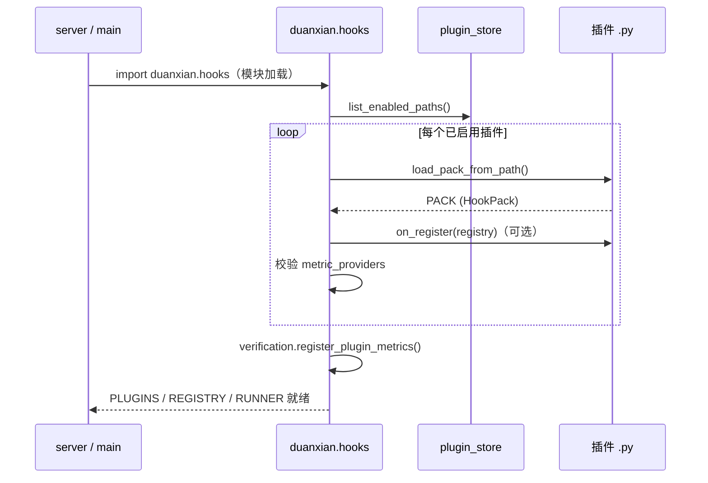
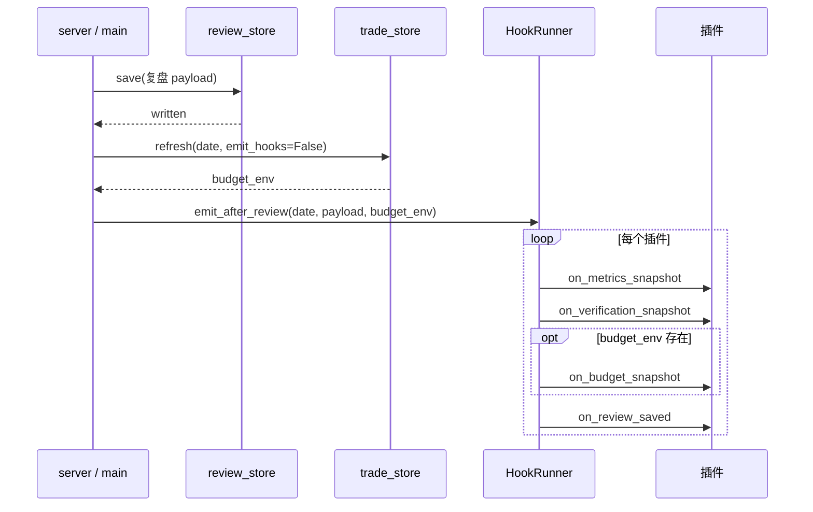

# 钩子生命周期

本文说明 vibe-astock **插件钩子**在进程内何时加载、何时派发、事件之间是什么顺序。插件怎么写见 [plugin-development.md](./plugin-development.md)。

## 总览

钩子系统分两层：

| 层 | 方向 | 说明 |
|---|---|---|
| **数据暴露（push）** | 引擎 → 插件 | 复盘、预算、验证条件等落盘后，引擎把结构化快照推给已注册回调 |
| **数据导入（pull）** | 插件 → 引擎 | 插件在 `on_register` 里拿到 `HookRegistry`，可写入持仓、账户、预算档位等 |

注册表路径：`~/.vibe-astock/plugins.json`。管理命令：`python -m duanxian.plugin_cli`。

---

## 进程生命周期



### 加载时机

- 在 **Python 进程首次 import `duanxian.hooks`** 时执行 `_init()`，通常发生在 `server.py` 或 `main.py` 启动后的第一次钩子调用之前。
- 导出三个单例：`PLUGINS`、`REGISTRY`、`RUNNER`。业务代码应使用 `hooks.RUNNER` 派发、`hooks.REGISTRY` 仅在插件 `on_register` 内由引擎注入。

### 加载规则

1. 只加载注册表中 **enabled=true** 且 **文件仍存在** 的插件。
2. 单个插件 `import` 失败：打印警告并跳过，**不阻断** 引擎启动。
3. `on_register` 抛错：打印 traceback，该插件其余能力仍尝试注册（如 `metric_providers`）。
4. `metric_providers` 经 `_validate_providers` 过滤（key 冲突、缺 getter、ai_pool 样本算不出值等会跳过并打日志）。

### 变更生效

通过 `plugin_cli` 的 `register` / `enable` / `disable` / `uninstall` **只改注册表文件**，**不会**热加载到已运行进程。修改插件代码或注册表后需 **重启 server**（或重新跑 `main.py`）。

---

## 事件生命周期

所有 push 事件都经 `HookRunner` 派发。每个已启用插件若实现了对应回调，会收到：

1. **`HookContext`** —— 轻量上下文（日期、事件名、插件 id/版本、引擎版本、发出时间）。
2. **信封 dict** —— 顶层含 `$schema`（见 `duanxian.hook_schemas`）、`event`、`date`、`emitted_at`、`engine_version`、`plugin`、`payload`。

回调内异常由引擎捕获并打印，**不会影响复盘主流程或其他插件**。

### 事件一览

| 事件名 | 回调字段 | 典型触发点 | `payload` 内 `$schema` |
|---|---|---|---|
| `metrics.snapshot` | `on_metrics_snapshot` | 复盘保存后；可单独调用 | `metrics-snapshot/1.0.0` |
| `verification.snapshot` | `on_verification_snapshot` | 复盘保存后；用户保存明日验证条件后 | `verification-snapshot/1.0.0` |
| `budget.snapshot` | `on_budget_snapshot` | `trade_store.refresh(emit_hooks=True)`；复盘保存后（有预算时） | `budget-snapshot/1.0.0` |
| `review.saved` | `on_review_saved` | 复盘保存后（聚合事件） | `review-saved/1.0.0`（内层） |

信封层统一使用 `envelope/1.0.0`。

### 复盘保存：`emit_after_review`

`server.py` 与 `main.py` 在复盘 JSON **成功写入** 后调用：

```text
trade_store.refresh(date, emit_hooks=False)   # 写 trade/{date}.json，此处不单独发 budget 钩子
hooks.RUNNER.emit_after_review(date, payload, budget_env)
```

`emit_after_review` 对 **每个插件** 按固定顺序派发（`budget_env` 为 `None` 时跳过 budget 相关）：

```text
1. metrics.snapshot      （scope=review）
2. verification.snapshot
3. budget.snapshot       （仅当 budget_env 非空）
4. review.saved          （聚合 metrics + verification + budget，可关 enable_review_saved）
```



`review.saved` 的 `payload` 内已包含当次构建好的 `metrics`、`verification`、`budget` 子对象，避免插件重复拉取。若只需监听「一整包复盘落盘」，实现 `on_review_saved` 即可；若要对某一类数据做流式处理，可只订阅单项快照。

`enable_review_saved=False` 时跳过第 4 步，但仍会收到前面的分项快照。

### 仓位预算刷新：`budget.snapshot`

`duanxian.trade_store.refresh(date)` 默认 `emit_hooks=True`，在写入 `~/.duanxian-agents/trade/{date}.json` 后调用 `RUNNER.emit_budget`。

复盘流程里故意传 `emit_hooks=False`，是为了在 `emit_after_review` 里 **只发一次** budget，并与 metrics、verification 一起打进 `review.saved`。

其他直接调用 `refresh()` 的代码路径（若存在）会单独触发 `budget.snapshot`。

### 验证条件编辑：`verification.snapshot`

用户在前端保存「明日验证条件」时，`POST /api/verification/items` 在落盘后：

1. 读取当日已存在的复盘 `review_store.load(date)`。
2. 若复盘存在，调用 `RUNNER.emit_verification(date, rev)`。

此时 **不会** 重跑 `emit_after_review`，也不会自动发 `metrics` / `budget` / `review.saved`。

### `metrics.snapshot` 的 scope

`build_metrics_payload(scope, date, review)` 支持：

| scope | 含义 |
|---|---|
| `review` | 复盘内的 `emotion_metrics`、`market_facts`，以及 short_board / breadth / mood_blocks 等定稿侧数据 |
| `live` | 附加 `live_emotion` 实时快照 |
| `both` | 二者兼有 |

当前引擎在 `emit_after_review` 中固定使用 `scope="review"`。插件若需要 live 数据，可在回调里自行调用 `build_metrics_payload("live", date, review)`（需 `from duanxian.hooks import build_metrics_payload`）。

---

## 与 Prompt 包的关系

| 机制 | 文件位置 | 作用 | 生效方式 |
|---|---|---|---|
| **Prompt 包** | `~/.vibe-astock/prompts_local.py` 的 `PACK` | 换分析师语气、裁判产出结构 | 引擎自动发现，改文件后下次复盘生效 |
| **钩子插件** | 任意 `.py`，注册到 `plugins.json` | 订阅盘面快照、回写持仓/账户/预算 | 需 `plugin_cli register`，**重启进程** |

二者正交：Prompt 包管「怎么说」，插件管「数据进出引擎」。

---

## 调试建议

1. **看是否加载**：启动日志中 `ℹ️ 已加载插件：…`；`python -m duanxian.plugin_cli list`。
2. **本地试回调**：参考 `tests/test_hooks.py` 里构造 `HookRunner` + `LoadedPlugin` 的写法。
3. **看 payload 形状**：在回调里把 `envelope["payload"]` 落盘为 JSON，对照 `duanxian.hook_schemas` 中的 `$schema` 常量。
4. **复盘未触发**：确认 `review_store.save` 返回 `written=True`；预算失败只影响 `budget_env`，不阻断其余钩子。

---

## 版本字段

- `hook_schemas.ENGINE_VERSION`：引擎侧钩子协议版本（当前 `0.1.3`）。
- `hook_schemas.SCHEMA_VERSION`：JSON payload 的 `schema_version`（当前 `1.0.0`）。
- 插件 `HookPack.version`：插件自述版本，出现在信封 `plugin.version` 中。

升级引擎时若破坏 payload 形状，应同步 bump `schema_bundle` 并在插件内做兼容分支。
